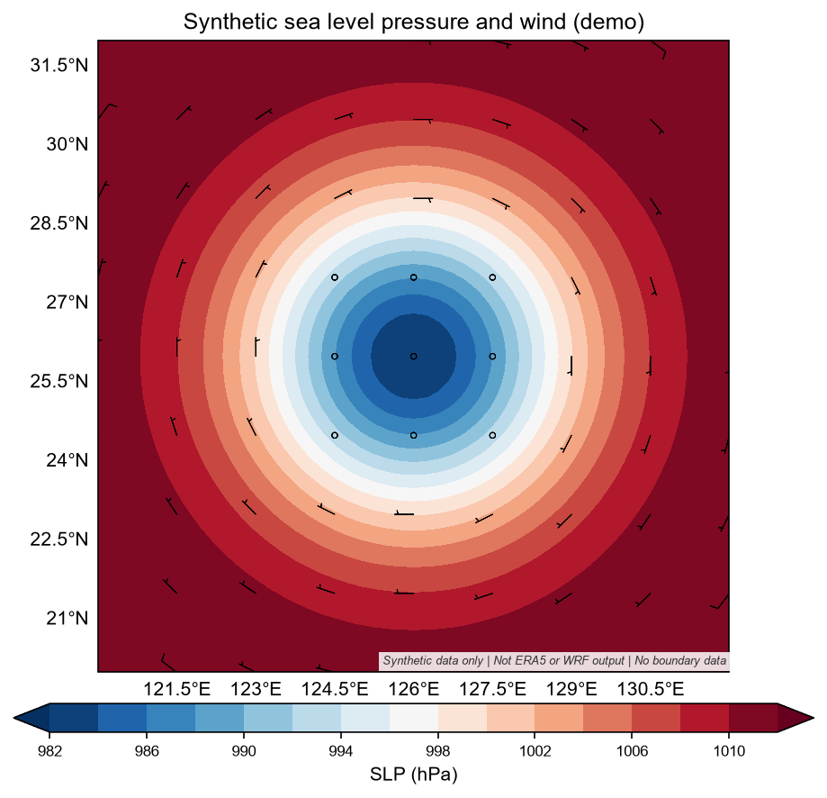

# ERA5 WRF Pipeline

**从 ERA5 驱动数据到 WRF 超算模拟，再到本地科研气象图的可复用 Agent Skill。**

面向区域数值天气预报、天气个例研究和 WRF 结果分析。包含工作流指令、站点配置说明、报错诊断参考及轻量提取、绘图脚本；以昆山曙光 SLURM 环境为参考，也可根据实际站点调整。

> 这不是开箱即用的一键 WRF 程序。下载脚本、namelist 和作业脚本需要由智能体按确认后的实验配置生成；使用者须具备 CDS 访问权限、SSH 连接和已安装的 WRF/WPS 环境。

## 流程

```text
需求澄清与实验计划确认
          |
          v
CDS / ERA5 下载（气压层 + 地面层）
          |
          v
WPS: geogrid -> ungrib -> metgrid
          |
          v
SLURM: real.exe -> wrf.exe
          |
          v
超算端 wrfout 轻量提取
          |
          v
SCP 回传 CSV / NPZ 等结果
          |
          v
本地 matplotlib / cartopy 科研气象图
```

作业失败时读取 WPS、SLURM 和 `rsl.error.*` 日志，区分参数、环境与科学设计问题，记录有限次数的重试。物理方案、驱动数据和实验设计的变更须由用户确认。

## 安装与使用

版本化的安装包与源码 ZIP 可在 [GitHub Releases](https://github.com/SpoiledTulip/era5-wrf-pipeline/releases) 下载。当前版本为 `v0.1.1`。

推荐让支持本地技能的智能体安装仓库中的 **`era5-wrf-pipeline/` 子目录**，而不是整个仓库。可向 Codex 的 `skill-installer` 提供：

```text
用 skill-installer 安装这个 skill：
https://github.com/SpoiledTulip/era5-wrf-pipeline/tree/main/era5-wrf-pipeline
```

也可下载 [era5-wrf-pipeline.skill](era5-wrf-pipeline.skill)。它是 ZIP 格式的分发包，解压后将完整的 `era5-wrf-pipeline/` 文件夹放入目标工具支持的技能目录；安装位置和刷新方式以所用工具为准。

安装后可提出这样的任务：

```text
使用 era5-wrf-pipeline，帮我设计一次 ERA5 驱动的区域 WRF 个例模拟。
先确认起止时间、区域、嵌套、物理方案、资源和出图清单；
我确认实验计划后再下载数据并提交作业。
```

## 环境与私有配置

| 部分 | 准备内容 |
| --- | --- |
| 数据访问 | CDS 账号、对应数据集使用权限、本机已配置的 `~/.cdsapirc` 和 `cdsapi` |
| 超算 | SSH、SLURM、可用的 WRF/WPS 二进制、MPI/编译运行环境、WPS 地理数据 |
| 案例校验 | Python、PyYAML |
| 数据提取 | Python 及所选提取功能需要的科学计算依赖，见脚本导入和帮助 |
| 本地绘图 | NumPy、matplotlib >= 3.9、cartopy、地图矢量数据；中文图还需可用字体 |

站点配置项包括：

| 字段 | 含义 |
| --- | --- |
| `HPC_SSH_ALIAS` / `HPC_USER` | SSH 别名与超算账号 |
| `HPC_WORK_ROOT` | 远端案例工作根目录 |
| `WRF_ROOT` / `WPS_ROOT` | 模式安装路径 |
| `HPC_PYTHON` | 远端 Python 解释器绝对路径 |
| `SLURM_PARTITION` | 可用计算分区 |
| `WPS_GEOG_ROOT` | WPS 静态地理数据目录 |
| `LOCAL_CASE_ROOT` / `GIS_ROOT` | 本地案例与地图数据目录 |

这些是待用户提供的配置字段，不会由 skill 自动加载；不要把占位符直接用于提交作业。详细说明见 [站点配置参考](era5-wrf-pipeline/references/wrf-on-kunshan.md) 和 [案例配置指南](era5-wrf-pipeline/references/case-config-guide.md)。

**账号、密钥、SSH 私钥、CDS 凭据及个人目录配置只在本机保留，不提交到仓库。**

本地可在独立虚拟环境安装绘图依赖：

```bash
python -m pip install -r era5-wrf-pipeline/requirements-local.txt
```

超算端依赖见 [requirements-hpc.txt](era5-wrf-pipeline/requirements-hpc.txt)。该文件是依赖范围参考，尚未在所有站点解析安装验证；优先使用站点验证过的 wrf-python/NetCDF/MPI 环境，不要直接修改共享环境。站点 Python、编译器和 NumPy ABI 兼容性需另行确认。

## 离线示例与测试

不连接 CDS 或超算也可验证配置预检查和绘图：

```bash
python era5-wrf-pipeline/scripts/validate_case.py examples/case.example.yaml
python examples/offline_demo.py
python -m unittest discover -s tests -v
```

配置示例中的 `num_metgrid_levels` 暂为 `null`，预检查会提示不能提交 real。WPS 完成后从 `met_em` 核验实际层数并填入，再执行：

```bash
python era5-wrf-pipeline/scripts/validate_case.py case.yaml --metgrid-levels ACTUAL_LEVEL_COUNT
```

`ACTUAL_LEVEL_COUNT` 必须替换为真实文件中的整数。`e_vert` 是模式垂直网格设置，不与输入资料层数固定相差一层。

离线示例生成 `examples/output/synthetic_slp.npz` 和 `synthetic_slp.png`，不下载底图数据。下图为**合成测试数据，不是 ERA5、WRF 模拟或预报结果**：



GitHub Actions 在 Python 3.11/3.12 上执行相同离线测试。测试包含配置有效/无效分支、模拟数据适配器的 NPZ 序列化、时间戳和绘图非空检查；不代表真实 wrfout 的全部诊断量、单位、插值或完整 ERA5 → WRF 工作流已验证。

`v0.1.1` 同时修正了指定时次的 hPa 等压面插值、地面变量转换和配图风场的地球坐标旋转。平面产品增加单位与 UTC 时间元数据；廓线高度键从 `height_gpm` 改为 `height_m`，下游脚本需相应更新。真实资料与科学诊断仍需使用者独立核验。

## 脚本与输出

| 文件 | 用途 |
| --- | --- |
| `scripts/validate_case.py` | 校验案例 YAML 的部分机械一致性，不代替科学设计审查 |
| `scripts/extract_wrf.py` | `plane` 平面场、`series` 序列、`profile` 垂直廓线、`track` 台风路径 |
| `scripts/wxplot.py` | 公共地图、配色、字体、风场和图片输出规范 |
| `scripts/example_plane_field.py` | 平面场绘图示例 |
| `scripts/example_track_map.py` | 模拟路径绘图示例；仅在明确要求时叠加对比资料 |

绘图规格：`draft` 为 150 dpi PNG，`presentation` 为 200 dpi PNG，`publication` 为 300 dpi PNG 和 PDF。默认只画模型自身结果，不自动添加实况或模型间对比。

完整指令入口：[SKILL.md](era5-wrf-pipeline/SKILL.md)。

## 使用边界

- 用户确认实验计划后才开始下载、提交作业。
- 重计算走 SLURM，不在登录节点前台运行 WPS、real 或 WRF。
- 原始 `wrfout` 留在超算，只回传轻量提取结果和图片。
- 地图边界、变量单位、时区和来源必须核对；科研图不等同于业务预报产品。
- 示例模块版本和路径须按实际站点验证；安装 skill 不代表已完成端到端模拟验证。
- 尚未选定 LICENSE；不要把仓库公开可见理解为已授予任意使用、修改和再分发权限。

## 技术参考

- [WRF Users Guide](https://www2.mmm.ucar.edu/wrf/users/wps.html)：WPS 输入与模式配置。
- [wrf-python getvar](https://wrf-python.readthedocs.io/en/latest/user_api/generated/wrf.getvar.html)：诊断变量、单位和风场。
- [wrf-python interplevel](https://wrf-python.readthedocs.io/en/latest/user_api/generated/wrf.interplevel.html)：等压面插值。
